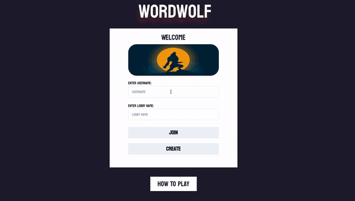
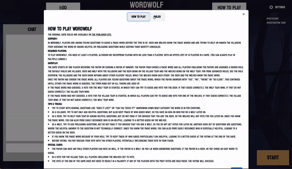
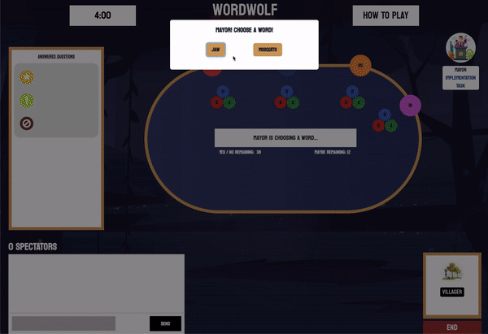

&emsp;&emsp;&emsp;&emsp;&emsp;&emsp; 

## Technologies ## 

**Front-end:** &emsp;&nbsp;&nbsp;
  
  
  
  

**Back-end:** &emsp;&nbsp; &nbsp;
  
  
  
  
**Design:** &emsp;&emsp; &nbsp; &nbsp;
  

**Deployment:** &nbsp;&nbsp;
  

&emsp;
  
## Overview ##

WordWolf is a multiplayer browser game formatted after Werewords. It allows up to 10 players/spectators and a minimum of four players to start. A player can be assigned one of 3 roles - Wolf, Seer, or Villager. One player will also be assigned the role of Mayor. A word is chosen and the players have to attempt to guess the word by only asking "yes" or "no" questions before the time or their tokens run out. But *watch out, not everyone's on your side...* There's a wolf or two in the mix that know the word and are trying to lead you in the wrong direction. Luckily you have your seer(s) in your corner to help get you back on track! Watchout wolves, make yourself too obvious and, even if the players don't guess the word, they can still win by finding out who you are. Seers don't be too helpful, if the word is guessed, the wolves still have an opputunity to win if they discover your true identity.

&emsp;

## Roles ##

|**Mayor**                      |**Wolf**                        |**Seer**                               |**Villager**                    |
|-------------------------------|--------------------------------|---------------------------------------|--------------------------------|
|1 player                       |1-2 players                     |1-2 players                            |2-6 players                     |
|Always has another role        |Knows the word                  |Knows the word                         |Cannot see the word             |
|Choose/know word to start      |Can guess who the seers are     |Directs players to correct word        |Asks narrowing questions        |     
|Answers questions appropriately|Steers players from correct word|Winning game becomes lost if discovered|Votes who they think the wolf is|

&emsp;

### This game is currently deployed! Play it [here](http://www.wordwolf.xyz/) ###

---
## Features ##

### Join ###

&emsp;

&emsp; 

&emsp;

- Allows player to join or create a lobby
- Can't join lobbies not yet created
- Can't create duplicate lobbies
- Confirms unique username for lobby being joined
- How to play modal allows access to rules, tips, and roles
- Uses Socket.io and object oriented programming to support multiple games/lobbies

&emsp;

### Lobby ###

&emsp;

&emsp; 

&emsp;

- Utilizes Socket.io to serve a unified game state w/low latency
- Differentiates between host and other playersOnly host can start game and change settings
- Can choose up to 4 starting words to choose from
- Can set game duration between 1 and 30 minutes
- Allows up to 10 players or spectators
- Players can choose color/placement on table or spectate
- Requires a minimum of 4 players to begin a game
- Chat dynamically reflects player colors
- Chat lets newly joined users see prior chats
- Chat has auto-scroll
- Access to how to play modal

&emsp;

### Game Table ###

&emsp;

&emsp; 

&emsp;

- Real time game progression/state
- Allows players to check the questions/tokens for each player with interactive token modal
- Renders players' tokens dynamically for individuals and the group
- Renders proper view and modals based on game state and player role assignment
- Real time rendering of amount of tokens remaining (maybe, yes, or no)
- Ensures proper connectivity of all components for seamless game play
- Individual player roles reflected by player card
- Universal mayor role display
- Mayor has access to modal for answering questions
- Timer displays amount of time left and changes red in the last 10s
- Access to how to play modal
- Only table players can chat
- All table players except mayor can ask questions
- Voting modal displays at end of game to all applicable players based on their role

&emsp;

### This game is currently deployed! Play it [here](http://www.wordwolf.xyz/) ###
---

## Contributers ##

Product Manager & Software Engineer: &emsp;**Eunice Kim**
&emsp; &emsp; &emsp; &emsp; UI Engineer & Software Engineer: &emsp;**Amy Kwak**

&emsp;&emsp;  &emsp; 
&emsp; &emsp; &emsp; &emsp; &emsp; &emsp; &emsp; &emsp; &emsp; &emsp; &emsp; &emsp;  &emsp; 

&emsp;

Backend Architect & Software Engineer: &emsp;**Danny Wong**
&emsp; &emsp;&nbsp;&emsp; Software Engineer: &emsp;**Andy Chan**

&emsp;&emsp;  &emsp; 
&emsp; &emsp; &emsp; &emsp; &emsp; &emsp; &emsp; &emsp; &emsp; &emsp; &emsp; &emsp;  &emsp; 

&emsp;

Software Engineer: &emsp;**Annie Wang**
&emsp; &emsp; &emsp; &emsp; &emsp; &emsp; &emsp; &emsp; &emsp;&nbsp;&nbsp; &emsp;&emsp; Software Engineer: &emsp;**Bogdan Gordin**

&emsp;&emsp;  &emsp; 
&emsp; &emsp; &emsp; &emsp; &emsp; &emsp; &emsp; &emsp; &emsp; &emsp; &emsp; &emsp;  &emsp; 

&emsp;

Software Engineer: &emsp;**Casey Eads**

&emsp;&emsp;  &emsp; 

&emsp;

## Installation ##

To run this application off your local computer, please clone this repo and perform the following:

- Make a .env file with contents PORT=3000

- Install necessary libraries

  - `npm i --production`

- Build

  - `npm run build`

- Start the server

  - `npm start`

- Go to localhost:3000 for access to WordWolf
